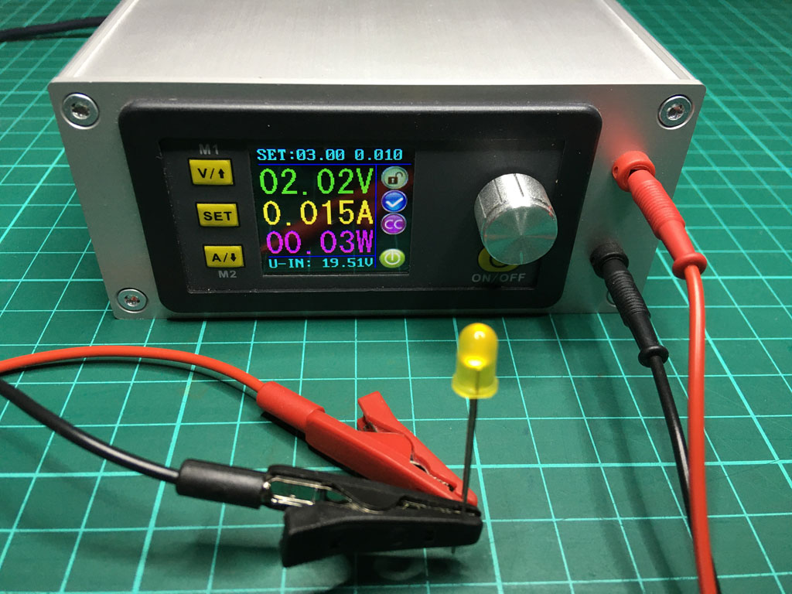
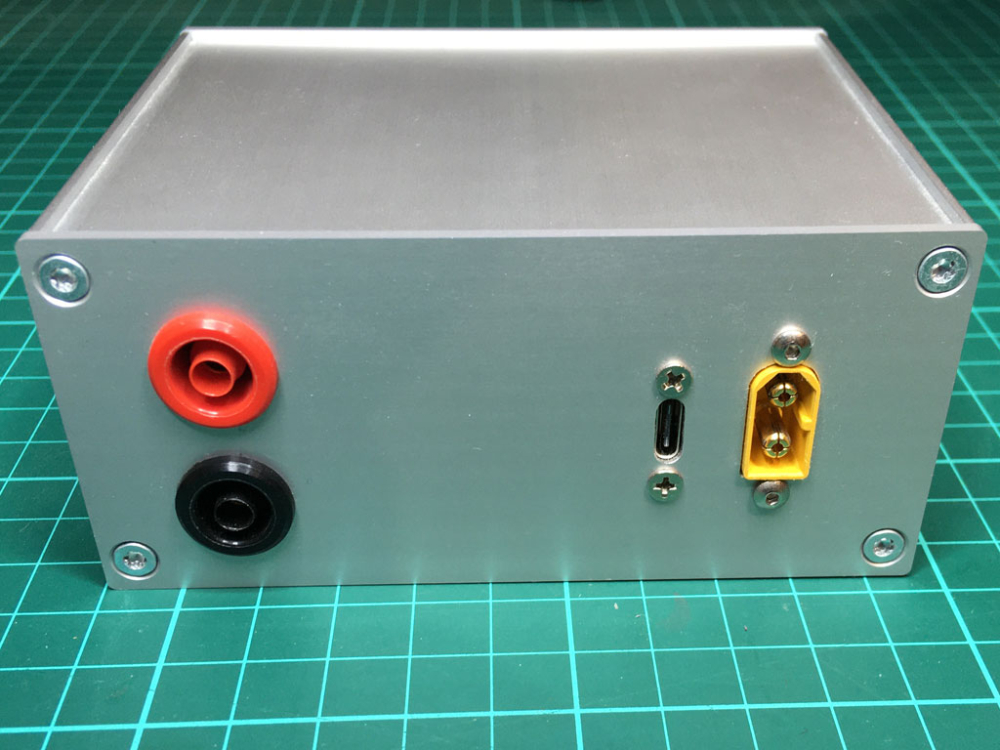
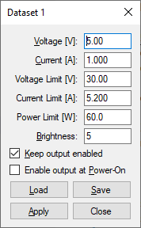

# Windows GUI for Riden DPS5005 power supply

## Overview

The Chinese manufacturer [Ruideng](http://www.ruidengkeji.com/) offers a series of general-purpose power supplies, and one of the most popular models is the DPS5005. Fitted with a small aluminum casing, an XT60E power connector, and some banana jacks, it makes a very nice portable power supply that can be powered either from an old laptop power brick or a 6S LiPo battery.

One of the problems of the DPS5005 is the supplied PC software: There is a whopping 230MB download containing a NI VISA based Windows application that just did not do the job for me.

Some time ago, I had a need for a command-line application to control and monitor the power supply, so I wrote a small C# library that can control the DPS5005 via its serial port. I recently rewrote the application and added a GUI, which I am releasing here.

## Features

- Scalable GUI display with the most important parameters
- Set voltage and current via GUI
- Set dataset parameters via GUI
- Set various parameters via the command-line

> Note: This software is designed to work with the original firmware using the Modbus protocol. The [OpenDPS firmware](https://github.com/kanflo/opendps) is not compatible with this software, as it does not support the Modbus protocol.

## Download

To get the latest version of **RidenDPS for Windows**, go to the [releases folder](https://github.com/mariusgreuel/ridendps/releases):

<https://github.com/mariusgreuel/ridendps/releases>

## Development and Building

If you want to modify and build the executable, you will need Visual Studio 2019.

## License

This software is licensed under the GNU GPL-3.0 license.
